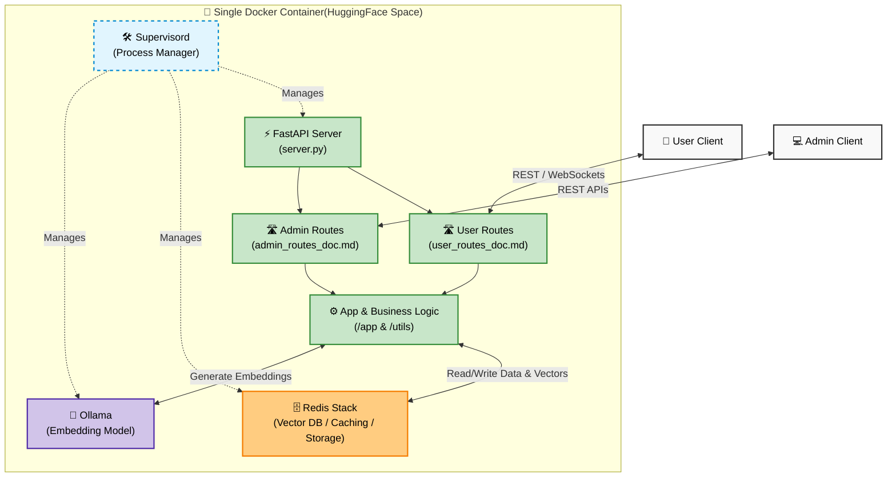

# Orvio HF Backend

This Space runs the FastAPI backend for Orvio. It includes Redis Stack and an Ollama embedding model bundled inside a single Docker container.

### 🏗️ Backend Architecture

```mermaid
graph TD
    %% Define Styles (Added color:#000; to force black text on light backgrounds)
    classDef client fill:#f9f9f9,stroke:#333,stroke-width:2px,color:#000;
    classDef docker fill:#e1f5fe,stroke:#0288d1,stroke-width:2px,stroke-dasharray: 5 5,color:#000;
    classDef api fill:#c8e6c9,stroke:#388e3c,stroke-width:2px,color:#000;
    classDef db fill:#ffcc80,stroke:#f57c00,stroke-width:2px,color:#000;
    classDef ai fill:#d1c4e9,stroke:#512da8,stroke-width:2px,color:#000;

    %% External Clients
    Client_User["📱 User Client"]:::client
    Client_Admin["💻 Admin Client"]:::client

    %% Docker Container Wrapper
    subgraph Docker_Container ["🐳 Single Docker Container(HuggingFace Space)"]
        
        %% API Layer
        FastAPI_Server["⚡ FastAPI Server<br/>(server.py)"]:::api
        Router_User["🛣️ User Routes<br/>(user_routes_doc.md)"]:::api
        Router_Admin["🛣️ Admin Routes<br/>(admin_routes_doc.md)"]:::api
        
        %% Processing Layer
        App_Logic["⚙️ App & Business Logic<br/>(/app & /utils)"]:::api
        
        %% Internal Services
        Redis["🗄️ Redis Stack<br/>(Vector DB / Caching / Storage)"]:::db
        Ollama["🧠 Ollama<br/>(Embedding Model)"]:::ai
        Supervisor["🛠️ Supervisord<br/>(Process Manager)"]:::docker
        
        %% Internal API Connections
        FastAPI_Server --> Router_User
        FastAPI_Server --> Router_Admin
        
        Router_User --> App_Logic
        Router_Admin --> App_Logic
        
        App_Logic <-->|"Read/Write Data & Vectors"| Redis
        App_Logic <-->|"Generate Embeddings"| Ollama
        
        %% Supervisor manages processes
        Supervisor -.->|"Manages"| FastAPI_Server
        Supervisor -.->|"Manages"| Redis
        Supervisor -.->|"Manages"| Ollama
    end

    %% External Connections
    Client_User <-->|"REST / WebSockets"| Router_User
    Client_Admin <-->|"REST APIs"| Router_Admin
```